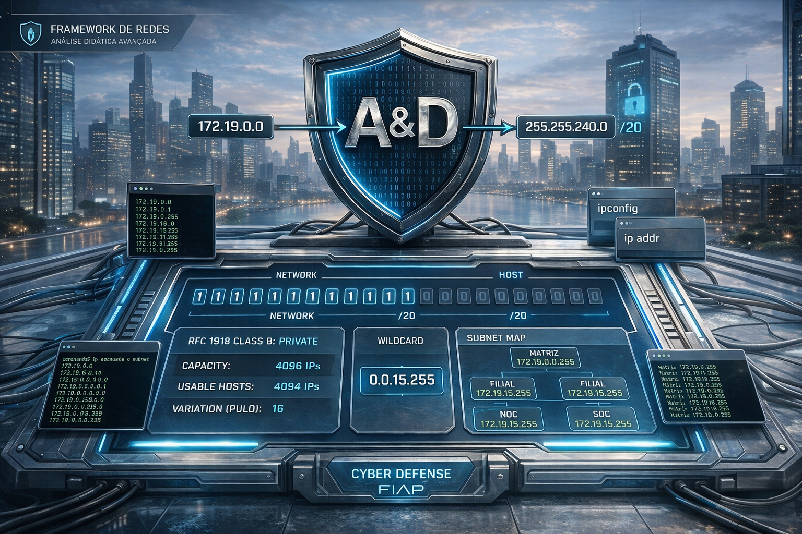
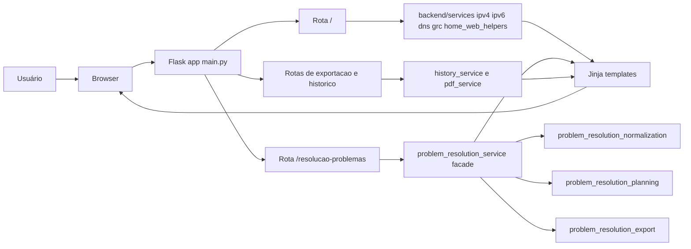
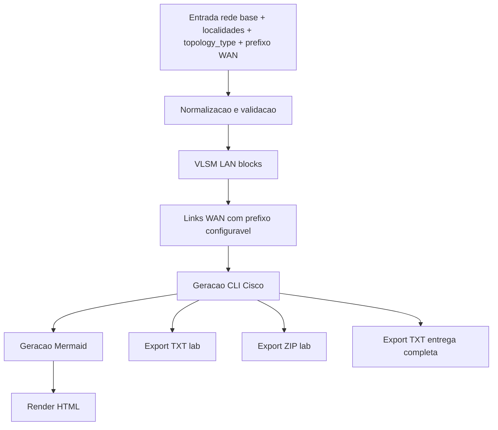
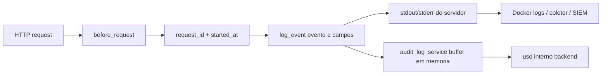

# 🛡️ Framework de Redes - Análise Didática Avançada

[](https://www.python.org/)
[](https://flask.palletsprojects.com/)
[](https://www.docker.com/)
[](#)
[](./LICENSE)

<p align="center">
  
</p>

Aplicação didática em Flask para análise de redes, com dois módulos principais:

- `Análise Didática`: CIDR, máscara, wildcard, DNS, IPv6, comparador, portas e protocolos.
- `Resolução de Problemas`: VLSM dinâmico para N localidades, topologia WAN (ring/mesh), CLI Cisco e exportação para laboratório.

> Repositório: [https://github.com/carmipa/FRAMEWORK_DE_REDES_ANALISE_DIDATICA_AVANCADA](https://github.com/carmipa/FRAMEWORK_DE_REDES_ANALISE_DIDATICA_AVANCADA)

---

## 📚 Sumário

- Visão geral
- Funcionalidades
- Arquitetura
- Execução local e Docker
- Variáveis de ambiente
- Logging e observabilidade (server-side)
- Estrutura de pastas
- Testes
- Roadmap

---

## 🎯 Visão Geral

O framework cobre fluxo didático completo para aula, laboratório e revisão técnica:

- cálculo de rede/broadcast/hosts úteis;
- decomposição binária e tabela AND por octeto;
- conversão entre CIDR, máscara e wildcard;
- resolução DNS com cache e timeout;
- classificação e contexto de risco/GRC;
- geração automática de cenário de laboratório (VLSM, links WAN com prefixo configurável, CLI e exportação para laboratório ou entrega em um único `.txt`).

---

## 🚀 Funcionalidades

### Módulo 1 - Análise Didática

- `CIDR`: IP + /barra.
- `Máscara`: decomposição por máscara decimal.
- `Wildcard`: engenharia reversa com base ACL/OSPF.
- `Auto CIDR`: inferência didática por IP.
- `Domínio`: hostname/URL -> DNS -> análise.
- `IPv6`: visão básica com resumo técnico.
- `Comparador`: comparação lado a lado entre dois prefixos.
- `Portas` e `Protocolos`: catálogo didático com filtros.

### Módulo 2 - Resolução de Problemas (VLSM + WAN)

- entrada dinâmica com N localidades (nome + quantidade de hosts);
- **CIDR da rede base** (super-rede): define o bloco IPv4 onde serão alocadas as sub-redes LAN e os links WAN;
  - **opcional**: se o campo ficar vazio, o sistema infere o prefixo pelo primeiro octeto do IP base (modelo didático *classful*: `10.x` → `/8`, `172.x` → `/16`, `192.x` → `/24`), alinhado ao botão “Auto CIDR” da análise principal;
- **Prefixo WAN** separado do CIDR da base (padrão `30` para enlaces ponto a ponto); os links seriais usam esse prefixo; intervalo aceito `0`–`30` (com validação de IPs utilizáveis por link);
- alocação VLSM automática por prioridade de hosts (maior demanda primeiro);
- topologia WAN `ring` ou `mesh` com alocação sequencial de sub-redes WAN dentro da rede base;
- diagrama lógico automático (Mermaid);
- blocos CLI Cisco por roteador (LAN, seriais, DHCP pool, RIPv2);
- exportação:
  - **Lab** — `.txt` consolidado só com scripts IOS para colar no Packet Tracer;
  - **Lab** — `.zip` com consolidado, configs por roteador, `LAB_TOPOLOGY.mermaid` e `README_LAB.txt`;
  - **Entrega** — `documentacao_cenario_rede.txt` com resumo, tabelas LAN/WAN, topologia Mermaid em texto, passos sugeridos e todos os scripts CLI (adequado para entregar documentação da atividade).

---

## 🏗️ Arquitetura

### Arquitetura geral da aplicação



### Fluxo do módulo de resolução VLSM/WAN



### Fluxo de logging server-side (sem tela de logs)



---

## ▶️ Execução

### Docker (recomendado)

```bash
docker compose up --build
```

Acesse: [http://127.0.0.1:5000](http://127.0.0.1:5000)

Parar:

```bash
docker compose down
```

### Python local

Windows PowerShell:

```powershell
python -m venv .venv
.\.venv\Scripts\Activate.ps1
pip install -r requirements.txt
python main.py
```

Linux/macOS:

```bash
python3 -m venv .venv
source .venv/bin/activate
pip install -r requirements.txt
python main.py
```

---

## ⚙️ Variáveis de Ambiente

- `APP_HOST` (padrão `127.0.0.1`)
- `APP_PORT` (padrão `5000`)
- `APP_DEBUG` (padrão `true`)
- `APP_OPEN_BROWSER` (padrão `true`)
- `APP_LOG_LEVEL` (padrão `INFO`)
- `APP_LOG_COLOR` (padrão `1`) ativa cor no console quando houver suporte a TTY
- `APP_LOG_FORCE_COLOR` (padrão `1`) força cor mesmo sem TTY (útil em Docker/VPS)
- `DNS_CACHE_TTL_SECONDS` (padrão `180`)
- `DNS_RESOLVE_TIMEOUT_SECONDS` (padrão `3.0`)
- `APP_AUDIT_LOG_LIMIT` (padrão `400`)

Exemplo:

```bash
APP_HOST=0.0.0.0 APP_PORT=5000 APP_DEBUG=false APP_LOG_LEVEL=INFO APP_LOG_COLOR=1 APP_LOG_FORCE_COLOR=1 APP_AUDIT_LOG_LIMIT=800 python main.py
```

---

## 📋 Logging e Observabilidade (Server-Side)

O logging é orientado a servidor e não possui tela dedicada na interface do usuário.

Implementado:

- timestamps em UTC (`Z`);
- `request_id` por requisição;
- eventos estruturados (`evento=...`, `status=...`, `modo=...`);
- logs de uso com motivo (`reason`) para trilha operacional;
- `before_request` e `after_request` para ciclo completo;
- logs de erro com stack trace apenas no backend;
- mensagens seguras no frontend sem exposição de detalhes internos.

Coleta recomendada em produção:

- `docker logs` / `compose logs`;
- agregador central (ELK, Loki, Datadog, Splunk, SIEM).

---

## 🗂️ Estrutura de Pastas

```text
FRAMEWORK_DE_REDES_ANALISE_DIDATICA_AVANCADA/
├── main.py
├── backend/
│   ├── common.py
│   └── services/
│       ├── audit_log_service.py
│       ├── dns_service.py
│       ├── grc_service.py
│       ├── history_service.py
│       ├── home_web_helpers.py
│       ├── ipv4_service.py
│       ├── ipv6_service.py
│       ├── pdf_service.py
│       ├── problem_resolution_normalization.py
│       ├── problem_resolution_planning.py
│       ├── problem_resolution_export.py
│       └── problem_resolution_service.py
├── templates/
│   ├── index.html
│   ├── resolucao_problemas.html
│   └── partials/
├── static/css/app.css
├── tests/test_app.py
├── Dockerfile
├── docker-compose.yml
└── requirements.txt
```

---

## ✅ Testes

Executar suíte:

```bash
python -m unittest discover -s tests -v
```

A suíte cobre:

- validações dos modos principais;
- resolução de problemas com múltiplas localidades;
- topologias WAN ring e mesh;
- exportações laboratório (`.txt` consolidado e `.zip`);
- regressões de comportamento e renderização crítica.

> O relatório único de entrega (`export_entrega` → `documentacao_cenario_rede.txt`) pode ser validado manualmente após o cálculo do cenário na interface.

---

## 🧹 Clean Code Aplicado

O projeto adota funções puras e módulos por responsabilidade (sem classes para regras de domínio).

- `problem_resolution_service.py` atua como fachada/orquestrador.
- Regras de resolução foram separadas em:
  - `problem_resolution_normalization.py`
  - `problem_resolution_planning.py`
  - `problem_resolution_export.py`
- Helpers da camada web da home foram extraídos para:
  - `home_web_helpers.py`

Esse desenho reduz acoplamento e facilita manutenção incremental.

---

## 🛣️ Roadmap

- [x] VLSM dinâmico para N localidades
- [x] topologia WAN ring/mesh
- [x] geração CLI Cisco + export laboratório
- [x] prefixo WAN configurável (separado do CIDR da rede base)
- [x] CIDR da rede base opcional com inferência didática pelo IP
- [x] exportação texto único para entrega acadêmica (`documentacao_cenario_rede.txt`)
- [x] logging estruturado com `request_id` e UTC
- [x] responsividade geral da interface
- [ ] persistência externa de logs operacionais (arquivo/stack observabilidade)
- [ ] filtros avançados de histórico por período e modo

---

## 👨‍💻 Autor

Paulo André Carminati | RM570877 | FIAP 2026 | CyberSegurança

---

## 📄 Licença

MIT.
