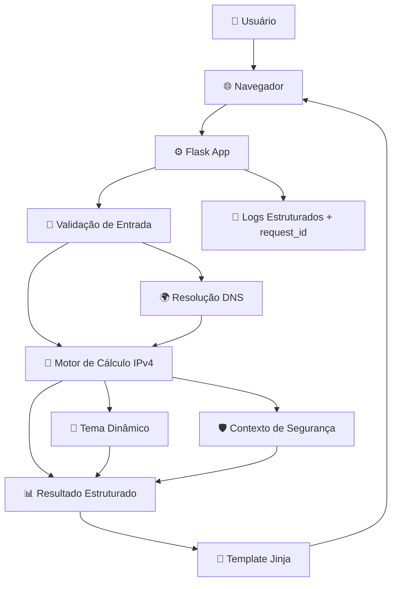

# 🛡️ Framework de Redes - Análise Didática Avançada

[](https://www.python.org/)
[](https://flask.palletsprojects.com/)
[](https://www.docker.com/)
[](https://docs.docker.com/compose/)
[](#)
[](./LICENSE)

<p align="center">
  
</p>

Aplicação didática para estudo de redes IPv4 com foco em **subnetting, bitwise AND, wildcard, CIDR, DNS/hostname e contexto de segurança/GRC**.

> Projeto pensado para execução local (máquina do usuário), com interface web no navegador.
>
> 🔗 Endereço do projeto: [https://github.com/carmipa/FRAMEWORK_DE_REDES_ANALISE_DIDATICA_AVANCADA](https://github.com/carmipa/FRAMEWORK_DE_REDES_ANALISE_DIDATICA_AVANCADA)

---

## 📚 Sumário

- [Visão Geral](#-visão-geral)
- [Navegação Rápida](#-navegação-rápida)
- [Guia de Instalação e Execução](#-guia-de-instalação-e-execução)
- [Principais Funcionalidades](#-principais-funcionalidades)
- [Arquitetura](#-arquitetura)
- [Estrutura do Projeto](#-estrutura-do-projeto)
- [Como Executar](#-como-executar)
  - [Executar com Docker (recomendado)](#executar-com-docker-recomendado)
  - [Executar com Python local](#executar-com-python-local)
- [Modos de Cálculo](#-modos-de-cálculo)
- [Tema Dinâmico e Didática Visual](#-tema-dinâmico-e-didática-visual)
- [Logs, Exceções e GRC](#-logs-exceções-e-grc)
- [Variáveis de Ambiente](#-variáveis-de-ambiente)
- [Exemplos de Uso](#-exemplos-de-uso)
- [Roadmap](#-roadmap)
- [Contribuição](#-contribuição)
- [Licença](#-licença)

---

## 🔗 Navegação Rápida

> Acesse direto as áreas mais usadas deste README:

- [▶️ Executar com Docker](#executar-com-docker-recomendado)
- [💻 Executar com Python local](#executar-com-python-local)
- [⚙️ Variáveis de Ambiente](#-variáveis-de-ambiente)
- [🧪 Modos de Cálculo](#-modos-de-cálculo)
- [📋 Logs, Exceções e GRC](#-logs-exceções-e-grc)
- [🛣️ Roadmap](#-roadmap)

---

## 🧰 Guia de Instalação e Execução

### Pré-requisitos

- Git instalado
- Python `3.12+` (se for rodar local sem Docker)
- Docker + Docker Compose (se for rodar via container)

### 1) Clonar o projeto

```bash
git clone https://github.com/carmipa/FRAMEWORK_DE_REDES_ANALISE_DIDATICA_AVANCADA.git
cd FRAMEWORK_DE_REDES_ANALISE_DIDATICA_AVANCADA
```

### 2) Escolher forma de execução

#### Opção A — Docker (mais simples para usuários finais)

```bash
docker compose up --build
```

Abra no navegador: [http://127.0.0.1:5000](http://127.0.0.1:5000)

Para parar:

```bash
docker compose down
```

#### Opção B — Python local (ambiente virtual)

##### Windows (PowerShell)

```powershell
python -m venv .venv
.\.venv\Scripts\Activate.ps1
pip install -r requirements.txt
python main.py
```

##### Linux/macOS (bash/zsh)

```bash
python3 -m venv .venv
source .venv/bin/activate
pip install -r requirements.txt
python main.py
```

Abra no navegador: [http://127.0.0.1:5000](http://127.0.0.1:5000)

### 3) Rodar testes automatizados

```bash
python -m unittest tests/test_app.py
```

### 4) Solução rápida de problemas

- **Porta 5000 em uso**: encerre processo da porta ou altere `APP_PORT`.
- **Dependências falhando**: recrie `.venv` e reinstale `requirements.txt`.
- **Docker não sobe**: valide se Docker Desktop está aberto e saudável.

---

## 🎯 Visão Geral

O framework calcula e apresenta, de forma visual e explicativa:

- máscara, wildcard e CIDR;
- endereço de rede e broadcast;
- intervalo de hosts úteis;
- decomposição binária de 32 bits;
- tabela de AND (`IP x Máscara`);
- régua de sub-redes;
- classificação didática por classe IPv4;
- contexto de segurança para suporte a decisões GRC.

Também suporta entrada por **domínio/hostname** (ex.: `google.com`), resolvendo DNS automaticamente para IPv4 antes do cálculo.

---

## 🚀 Principais Funcionalidades

- ✅ Cálculo por `CIDR`
- ✅ Cálculo por `Máscara Decimal`
- ✅ Engenharia reversa por `Wildcard`
- ✅ Descoberta de CIDR por IP (lógica classful didática)
- ✅ Decomposição de domínio/hostname para IPv4
- ✅ Tabelas e blocos com comportamento dinâmico por cenário
- ✅ Tema visual dinâmico por severidade de rede
- ✅ Tooltips explicativos em campos e botões
- ✅ Logs estruturados com `request_id`
- ✅ Tratamento global de exceções com resposta segura ao usuário

---

## 🏗️ Arquitetura



---

## 🗂️ Estrutura do Projeto

```text
FRAMEWORK_DE_REDES_ANALISE_DIDATICA_AVANCADA/
├── icone.png
├── main.py
├── requirements.txt
├── Dockerfile
├── docker-compose.yml
├── .dockerignore
├── tests/
│   └── test_app.py
├── templates/
│   └── index.html
└── static/
    └── css/
        └── app.css
```

---

## ▶️ Como Executar

### Executar com Docker (recomendado)

```bash
docker compose up --build
```

Acesse: [http://127.0.0.1:5000](http://127.0.0.1:5000)

Parar:

```bash
docker compose down
```

#### Alternativa sem Compose

```bash
docker build -t framework-redes-analise .
docker run --rm -p 5000:5000 framework-redes-analise
```

---

### Executar com Python local

```bash
python -m venv .venv
.venv\Scripts\activate
pip install -r requirements.txt
python main.py
```

Acesse: [http://127.0.0.1:5000](http://127.0.0.1:5000)

---

## 🧪 Modos de Cálculo

1. **Pesquisar por CIDR**  
   Entrada: IP + CIDR

2. **Pesquisar por Máscara Decimal**  
   Entrada: IP + máscara decimal (ex.: `255.255.255.240`)

3. **Engenharia Reversa (Wildcard)**  
   Entrada: IP + wildcard (ex.: `0.0.15.255`)

4. **Descobrir CIDR do IP**  
   Entrada: IP, com inferência classful didática

5. **Decompor Domínio para IP**  
   Entrada: domínio/hostname (ex.: `google.com`), com resolução DNS e cálculo completo

---

## 🎨 Tema Dinâmico e Didática Visual

A interface adapta cores conforme o tamanho da rede:

- 🟢 `/24+` → Baixo risco operacional
- 🔵 `/17–23` → Risco moderado
- 🟠 `/9–16` → Risco elevado
- 🔴 `/0–8` → Risco crítico

Além disso, a aplicação identifica visualmente blocos:

- **Dinâmico por cálculo**
- **Misto (referência + cálculo atual)**
- **Referência fixa**

---

## 📋 Logs, Exceções e GRC

Implementações atuais:

- logs estruturados com timestamp, nível e `request_id`;
- ciclo completo de request (`before_request` / `after_request`);
- logging de eventos críticos de validação e DNS;
- `handler` global para exceções inesperadas;
- mensagens seguras ao usuário final sem exposição de stack trace.

Isso melhora rastreabilidade, auditoria e governança operacional.

---

## ⚙️ Variáveis de Ambiente

| Variável | Padrão | Descrição |
|---|---:|---|
| `APP_HOST` | `127.0.0.1` | Host da aplicação (`0.0.0.0` no Docker) |
| `APP_PORT` | `5000` | Porta HTTP |
| `APP_DEBUG` | `true` | Ativa/desativa modo debug |
| `APP_LOG_LEVEL` | `INFO` | Nível de log (`DEBUG`, `INFO`, `WARNING`, `ERROR`) |

Exemplo:

```bash
APP_HOST=0.0.0.0 APP_PORT=5000 APP_DEBUG=false APP_LOG_LEVEL=INFO python main.py
```

---

## 🧭 Exemplos de Uso

- `172.16.8.8/16` → rede corporativa privada ampla
- `192.168.1.10/24` → LAN tradicional
- `200.10.10.10/30` → enlace ponto a ponto
- `google.com` no modo domínio → resolução DNS + análise completa

---

## 🛣️ Roadmap

- [ ] suíte de testes automatizados para cenários críticos
- [ ] exportação de relatório (PDF/JSON)
- [ ] modularização completa do backend (`services/`, `routes/`)
- [ ] cache local para consultas DNS frequentes
- [ ] refinamento de acessibilidade e navegação por teclado

---

## 🤝 Contribuição

Sugestões e melhorias são bem-vindas.

1. Faça um fork
2. Crie uma branch (`feature/minha-melhoria`)
3. Commit suas mudanças
4. Abra um Pull Request

---

## 📄 Licença

Este projeto está licenciado sob a licença MIT.  
Se necessário, adicione um arquivo `LICENSE` na raiz para formalização completa.
